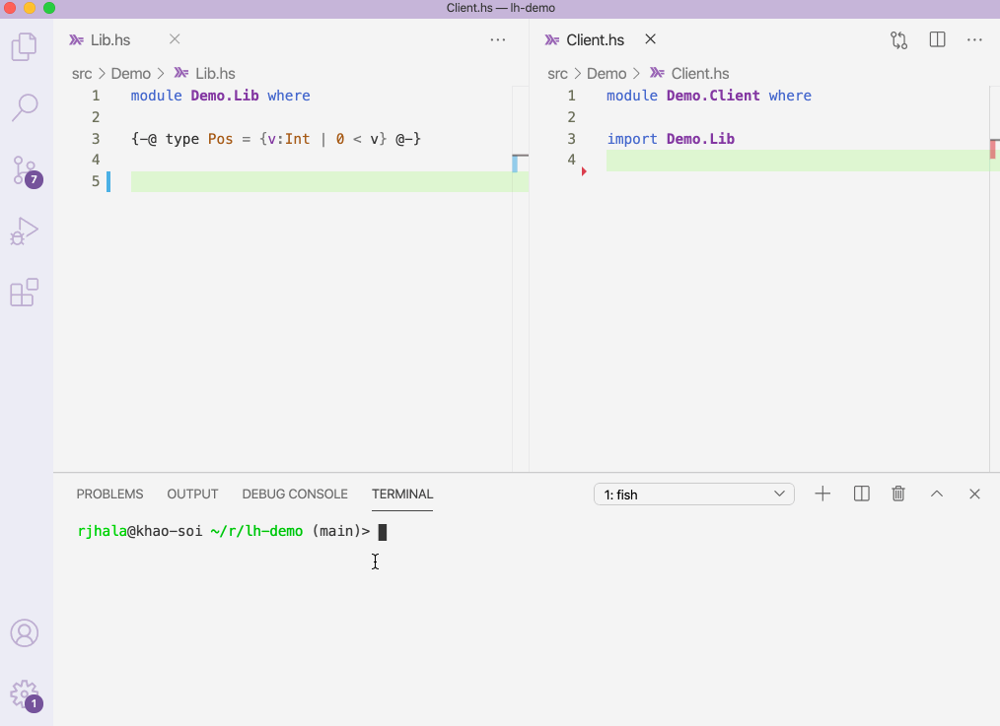

# LiquidHaskell as a GHC Plugin


Trace: [loadResult-bs] : "{\"o_vars\":null,\"o_types\":[[{\"spanInfo\":{\"startLine\":8,\"endLine\":8,\"endCol\":4,\"startCol\":1,\"filename\":\"src/Demo/Client.hs\"},\"realSpan\":true},[[\"Demo.Client.inc\",\"{VV : GHC.Types.Int | VV >= 0} -> {VV : GHC.Types.Int | VV >= 0}\"]]],[{\"spanInfo\":{\"startLine\":1,\"endLine\":1,\"endCol\":1,\"startCol\":1,\"filename\":\"src/Demo/Client.hs\"},\"realSpan\":true},[[\"Demo.Client.$trModule\",\"GHC.Types.Module\"]]],[{\"spanInfo\":{\"startLine\":8,\"endLine\":8,\"endCol\":10,\"startCol\":9,\"filename\":\"src/Demo/Client.hs\"},\"realSpan\":true},[[\"x\",\"{v : GHC.Types.Int | v >= 0\\n                     && v == x}\"]]],[{\"spanInfo\":{\"startLine\":8,\"endLine\":8,\"endCol\":14,\"startCol\":1,\"filename\":\"src/Demo/Client.hs\"},\"realSpan\":true},[[\"GHC.Num.$fNumInt\",\"{v : (GHC.Num.Num GHC.Types.Int) | v == $fNumInt}\"]]],[{\"spanInfo\":{\"startLine\":8,\"endLine\":8,\"endCol\":6,\"startCol\":5,\"filename\":\"src/Demo/Client.hs\"},\"realSpan\":true},[[\"x\",\"{VV : GHC.Types.Int | VV >= 0}\"]]],[{\"spanInfo\":{\"startLine\":8,\"endLine\":8,\"endCol\":14,\"startCol\":13,\"filename\":\"src/Demo/Client.hs\"},\"realSpan\":true},[[\"lq_anf$##7205759403792802743\",\"GHC.Types.Int\"]]]],\"o_templs\":[[{\"spanInfo\":{\"startLine\":8,\"endLine\":8,\"endCol\":4,\"startCol\":1,\"filename\":\"src/Demo/Client.hs\"},\"realSpan\":true},[[\"Demo.Client.inc\",\"lq_tmp$x##399:{VV##0 : GHC.Types.Int | VV##0 >= 0} -> {VV##0 : GHC.Types.Int | VV##0 >= 0}\"]]],[{\"spanInfo\":{\"startLine\":1,\"endLine\":1,\"endCol\":1,\"startCol\":1,\"filename\":\"src/Demo/Client.hs\"},\"realSpan\":true},[[\"Demo.Client.$trModule\",\"{VV##371 : GHC.Types.Module | $k_##372}\"]]],[{\"spanInfo\":{\"startLine\":8,\"endLine\":8,\"endCol\":10,\"startCol\":9,\"filename\":\"src/Demo/Client.hs\"},\"realSpan\":true},[[\"x\",\"{lq_tmp$x##423 : GHC.Types.Int | lq_tmp$x##423 >= 0\\n                                 && lq_tmp$x##423 == x##aE7}\"]]],[{\"spanInfo\":{\"startLine\":8,\"endLine\":8,\"endCol\":14,\"startCol\":1,\"filename\":\"src/Demo/Client.hs\"},\"realSpan\":true},[[\"GHC.Num.$fNumInt\",\"{lq_tmp$x##422 : (GHC.Num.Num GHC.Types.Int) | lq_tmp$x##422 == GHC.Num.$fNumInt}\"]]],[{\"spanInfo\":{\"startLine\":8,\"endLine\":8,\"endCol\":6,\"startCol\":5,\"filename\":\"src/Demo/Client.hs\"},\"realSpan\":true},[[\"x\",\"{VV##0 : GHC.Types.Int | VV##0 >= 0}\"]]],[{\"spanInfo\":{\"startLine\":8,\"endLine\":8,\"endCol\":14,\"startCol\":13,\"filename\":\"src/Demo/Client.hs\"},\"realSpan\":true},[[\"lq_anf$##7205759403792802743\",\"{lq_tmp$x##404 : GHC.Types.Int | lq_tmp$x##404 == lq_anf$##7205759403792802742##d2ns}\"]]]],\"o_bots\":[],\"o_result\":{\"result\":\"unsafe\",\"tags\":[{\"msg\":\"Liquid Type Mismatch\\n    .\\n    The inferred type\\n      VV : {v : GHC.Types.Int | v == x - 1}\\n    .\\n    is not a subtype of the required type\\n      VV : {VV : GHC.Types.Int | VV >= 0}\\n    .\\n    in the context\\n      x : {v : GHC.Types.Int | v >= 0}\",\"pos\":{\"spanInfo\":{\"startLine\":8,\"endLine\":8,\"endCol\":14,\"startCol\":1,\"filename\":\"src/Demo/Client.hs\"},\"realSpan\":true}}]}}"


This repo demonstrates how to use [LiquidHaskell](https://github.com/ucsd-progsys/liquidhaskell) as a GHC plugin.

`lh-plugin-demo.cabal` shows 

- how to tell GHC to invoke the plugin
- how to specify the relevant LH wrapper packages as dependencies

[stack.yaml](stack.yaml) shows

- how to point `stack` at the relevant LH repositories on **hackage**

[stack.yaml.github](stack.yaml) shows

- how to point `stack` at the relevant LH repositories on **github**

[cabal.project](cabal.project) shows

- how to point `cabal` to the relevant LH repositories on **hackage**

[cabal.project.github](cabal.project.github) shows

- how to point `cabal` to the relevant LH repositories on **github**

## GHCi Integration

By virtue of being a plugin, you now get LH errors 

- when you (re)load in GHCi. 

- from all editor plugins based on `ghci` integration

### GHCID

VSCode running `ghcid` in a terminal 



### VSCode 

VSCode with the `Simple GHC (Haskell) Integration` plugin 


### Emacs


### Vim

Vim/Neovim with `ALE` and the `stack-build` linter


## GHCID Integration

Additionally, [`ghcid`](https://github.com/ndmitchell/ghcid) produces LH errors on recompilation 

For `stack`-based projects, run with 

```
$ ghcid -c "stack ghci"
```

For `cabal`-based projects, run with 

```
$ ghcid -c "cabal v2-repl"
```

## Importing Specifications across Packages

The plugin also ensures that specifications written for one 
package are used when checking client packages. For an example, 
see the associated [lh-plugin-demo-client package](https://github.com/ucsd-progsys/lh-plugin-demo-client/).

## DEMO

1. Total.hs
2. Vectors.hs
3. Sort.hs
4. Maps.hs 
5. Voltron

